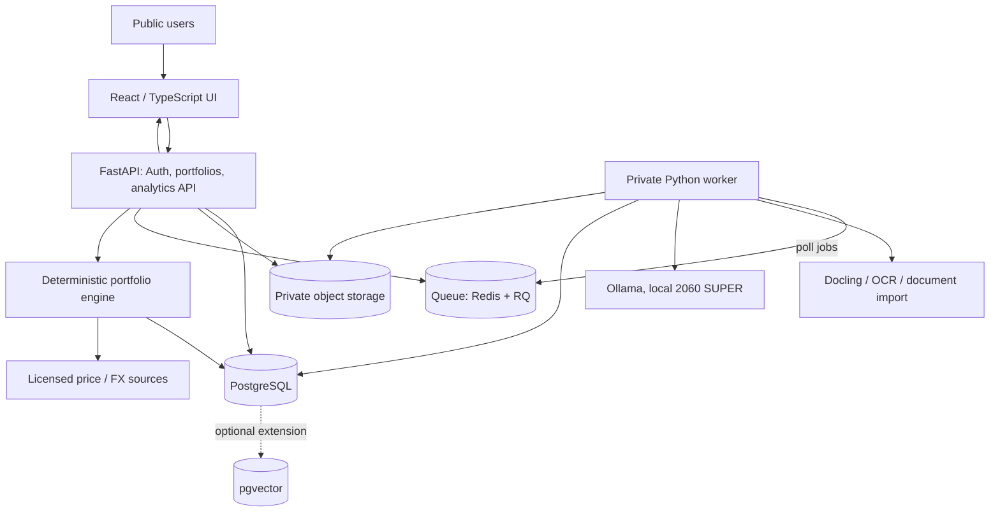

# Proposed Architecture (Not Yet Validated)

## System sketch

This is a candidate logical design, not an infrastructure diagram that has been deployed.

## Core boundaries

### Frontend

- React + TS + Vite; Tailwind + shadcn/ui; ECharts; TanStack Table and Query.
- UI owns import review, correction and visualization, **not financial calculations**.
- Calls a versioned backend API, possibly using OpenAPI-generated TS client.

### FastAPI / deterministic domain layer

- Authentication and authorization; tenant-owned portfolios, documents and jobs.
- Validates input with Pydantic; persistence with SQLAlchemy/Alembic.
- Ledger/snapshot handling, decimal accounting, FX normalization, risk and scenario calculations.
- Portfolio read endpoints stay operational when AI worker is offline.
- Explicitly separate internal numeric state from AI prompt descriptions.

### Import / document worker

- CSV/Excel: deterministic parsing + column mapping where possible.
- PDF/images: Docling/OCR, with optional image-capable model if benchmarks justify it.
- Extract into a staging table; attach provenance (document ID, page/region, extraction method, confidence or uncertainty marker).
- Never write unreviewed inference directly into the canonical ledger.
- Worker should treat file content as untrusted; prevent prompt injection from controlling tools or accessing other data.

### LLM and RAG

- Candidate chat: Qwen3 8B Q4 (text only); candidate vision: Qwen3.5 4B Q4; embeddings: Qwen3 Embedding 0.6B.
- Ollama hosted privately behind a worker. Do not expose the raw API on a public port.
- Prefer tool calls into deterministic portfolio metrics over embedding live holdings and prompting the LLM to calculate.
- RAG for thesis notes and long-form source evidence; embeddings indexed by user/portfolio/document/version.
- Ground answers with citations (including version and timestamp). No unverifiable source claims.
- Do not allow the LLM to execute arbitrary SQL, trades or cross-user queries.

### Queue and capacity

- Jobs include user/tenant, resource ownership, type, status, attempts and execution limits.
- Start with 1 model generation at a time; benchmark larger concurrency only when ready.
- Prevent duplicate submissions with idempotency keys.
- Expose queue position/status and failure/retry paths to the UI.
- Job worker makes an outbound authenticated connection to the service. Cloud hosting and connectivity pattern still need selection.

## Suggested logical entities (draft, not schema)

- `users` / `sessions`
- `portfolios` (`owner_id`, `base_currency`, `name`)
- `instruments` (`instrument_id`, `ticker`, `exchange`, `currency`, `asset_type`)
- `holdings_snapshots` and `snapshot_positions` (with as-of date, source and valuation quality)
- `transactions` (date, type, quantity, unit price, currency, fees, brokerage reference, idempotency key)
- `cash_flows`, `corporate_actions` (when scope is defined)
- `prices` and `fx_rates` (source, timestamps, adjustments, license constraints)
- `imports`, `import_files`, `import_rows` (staged, error states, source evidence)
- `theses`, `thesis_versions`, `thesis_evidence` (owner, date, confidence/source)
- `embeddings` (owner-scoped record/document/version ID)
- `ai_jobs`, `ai_conversations`, `ai_messages`, `ai_feedback`
- `audit_events`

Do not assume all entities must ship in Phase 1; establish financial-accounting invariants before implementing the final schema.

## Security and privacy

- Enforce ownership in every DB query and file/object access. Consider row-level security as additional defense; never rely only on client-side checks.
- Scan/validate file types and size; use private object storage and short-lived authorized access.
- Protect against prompt injection in user documents; keep tool permissions minimal.
- Encrypt TLS in transit, protect API secrets, maintain deletion/retention controls, and minimize personal investment information in logs.
- Rate-limit by user/IP and workload; monitor abusive upload and inference patterns.
- User thesis memory must never leak into other users' RAG results.

## Financial accuracy rules

1. Represent amounts with decimal/fixed-point types, explicit precision and rounding policy.
2. A snapshot is a point-in-time observation, not proof of historical buy/sell transactions.
3. Quote and FX timestamps must be displayed and reconciled across holdings.
4. Net deposits/withdrawals matter for performance; do not conflate portfolio value growth with returns.
5. Distinguish book cost, realized/unrealized P&L, dividend income, and currency impact.
6. Rebalance calculations must use explicit target weights and disclose estimated costs/assumptions.
7. Baseline fixtures and property tests must validate sums, fees, currencies and corporate actions before enabling downstream AI narratives.

## Operations to validate before deployment

- Benchmark import accuracy and tokens/sec/TTFT for sample PDFs/screenshots on the exact GPU.
- Measure peak VRAM for context size and any multi-model switching.
- Check public market data display terms, commercial use and quote freshness.
- Set cloud limits (CPU/RAM/DB/storage/egress), inference quotas and expected uptime.
- Set and test graceful degradation: when Ollama is offline, non-AI web and data features remain available.
